# SIMULADOR DE ESCALONAMENTO DE PROCESSOS

## INTEGRANTES
- KEVIN ÁVILA REHEM
- HENRIQUE PAIM
- ANTÔNIO CARLOS
- RHUAN AZEVEDO

## OBJETIVO
O projeto tem por objetivo por em prática conceitos de escalonamento de processos para melhor entendimento da matéria de Sistemas Operacionais
 
## RESUMO

O projeto "Simulador de Escalonamento de Processos" aplica conceitos de escalonamento de sistemas operacionais a um cenário de filas de atendimento hospitalar. O objetivo é permitir experimentar e comparar diferentes políticas de escalonamento (Round-Robin, Shortest Job First, Shortest Remaining Time First e Prioridade Não-Preemptivo) em um ambiente controlado, observando métricas como tempo de espera, tempo de atendimento e utilização dos profissionais.

- Principais componentes:
    - Modelo: as classes `Paciente` e `Medico` representam respectivamente os processos e os núcleos do processador, junto com enums para os algoritmos de escalonamento.
    - Visualização: telas e pop-ups (por exemplo, `TelaConfiguracaoGeral`, `TelaCriacaoPaciente`, `TelaSimulacao`, `TelaResumoPacientes`, `DialogConfigsMedico`) que permitem configurar a simulação, inserir pacientes e visualizar resultados.
    - Observers: implementação de observadores (por exemplo, `SimulacaoObserver`) para atualizar a interface conforme a simulação avança.

- Tecnologia:
    - Linguagem: Java
    - Build: Maven (`pom.xml` está no diretório `Hospital/`)

## DIAGRAMA UML


## PACIENTE (PROCESSO)
Classe que representa os processos criados pelos programas. Armazena diversos parâmetros de execução.

### ATRIBUTOS
- `private String name` ==> Tag representativa do processo(P1, P2...)
- `private int arrivalTime` ==> Momento em que o processochega à fila
- `private int burstTime` ==> Tempo total que cada Paciente(processo) será atendido (Executado) pelos Médicos (Cores).
- `private int priority` ==> Prioridade de atendimento doPaciente (Processo). Sendo 1 a maior e 5 a menor
- `private int quantum` ==> Quantia de tempo que o Pacienteocupará o Médico a cada vez que for atendido **(Apenas Round-Robin)**
- `private boolean firstRodeo` ==> Indica se é a primeira entrada do Paciente no consultório 

## MÉDICO (CORE)
Classe que representa os núcleos do processador, fará o trabalho de consumir os Pacientes a partir de uma lista compartilhada entre todos os Médicos. Detentor dos algoritmos de escalonamento.

### AlgoritmosEscalonamento (Enum)
```java
package org.example.model.enums;

public enum AlgoritmoEscalonamento {
    ROUND_ROBIN,
    SHORTEST_JOB_FIRST,
    SHORTEST_REMAINING_TIME_FIRST,
    PRIORITY_NON_PREEMPTIVE
}

``` 

### ATRIBUTOS
- #### VARIÁVEIS COMPARTILHADAS
    - private static List<Paciente> pacientes;  
    - private AlgoritmoEscalonamento algoritmoEscalonamento;

- #### COMUNICAÇÃO COM A UI
    - private SimulacaoObserver observer;

- #### CONTROLE DE TEMPO RELATIVO DA EXECUÇÃO
    - private long startTime = 0;
    - private boolean iniciado = false;

### IMPLEMENTAÇÕES
#### `public class Medico implements Runnable`
```java
public void run() {
        if (!iniciado) {
            this.startTime = System.currentTimeMillis();
            this.iniciado = true;
        }
        // Loop principal: Enquanto houver pacientes na lista
        while (true) {
            // Verifica se ainda há pacientes E se alguém não terminou
            // (se lista vazia, thread encerra)
            synchronized (pacientes) {
                if (pacientes.isEmpty()) break;
            }

            boolean trabalhou = false;
            switch (algoritmoEscalonamento) {
                case ROUND_ROBIN:
                    trabalhou = roundRobin();
                    // Se não trabalhou (ex: todos esperando arrival time), evita loop infinito consumindo CPU
                    if (!trabalhou) {
                        try {
                            Thread.sleep(100);
                        } catch (InterruptedException e) {
                        }
                    }
                    break;
                case SHORTEST_JOB_FIRST:
                    trabalhou = shortestJobFirst();
                    break;
                case SHORTEST_REMAINING_TIME_FIRST:
                    trabalhou = shortestRemainingTimeFirst();
                    break;
                default:
                    break;
            }
            if (!trabalhou) {
                try {
                    Thread.sleep(100);
                } catch (InterruptedException e) {
                }
            }
        }
    }
```

Método run inicia a simulação, capturando o tempo de início para registrar as métricas de execução. O algoritmo de escalonamento que será implementado será escolhido ao dar um set na variável global algoritmoEscalonamento

---

### Round-Robin
O algoritmo Round-Robin, ao executar, remove o primeiro processo da fila de execução (FIFO), executa ele pelo *`quantum`* de tempo definido na criação do Paciente. Em seguida, se ainda houver tempo de execução restante no Paciente, ele retorna ao final da fila estática de Pacientes, de forma sincronizada - a fim de evitar situações de disputa - e é executado novamente quando chega sua vez, novamente pelo mesmo *`quantum`* de tempo, até que não haja *`burstTime`* restante para o Paciente.

```java
public boolean roundRobin() {
        Paciente atual = null;

        synchronized (pacientes) {
            if (pacientes.isEmpty()) return false;

            // Vamos varrer a lista para achar alguém que já chegou.
            long tempoAtualSimulacao = System.currentTimeMillis();

            // Pega o primeiro (Fila FIFO do RR)
            atual = pacientes.remove(0);
        }

        if (atual == null) return false;

        try {
            if (atual.isFirstRodeo()) {
                Thread.sleep(50); // Pequeno delay visual para troca de contexto
                atual.setFirstRodeo(false);
            }

            // NOTIFICA INICIO (UI desenha verde)
            if (observer != null) observer.notificarInicioExecucao(atual);

            int tempoExecucao = Integer.min(atual.getQuantum(), atual.getBurstTime());

            // Simula processamento
            Thread.sleep(tempoExecucao);

            // Atualiza tempo restante
            atual.setBurstTime(atual.getBurstTime() - tempoExecucao);

            // NOTIFICA FIM (UI salva bloco azul)
            if (observer != null) observer.notificarFimExecucao(atual);

            // Se ainda tem burst time, volta pro fim da fila
            if (atual.getBurstTime() > 0) {
                synchronized (pacientes) {
                    pacientes.add(atual);
                }
            } else {
                if (observer != null) observer.notificarConclusao(atual);
            }
            return true;

        } catch (InterruptedException e) {
            throw new RuntimeException(e);
        }
    }
```

---

### Shortest Job First


---

### Shortest Remaining Time First

O algoritmo Shortest Remaining Time First (SRTF) é a versão preemptiva do Shortest Job First. A cada ciclo, ele seleciona o paciente que possui o menor tempo de execução restante (`burstTime`) entre aqueles que já chegaram (`arrivalTime <= tempoDecorrido`).

Diferente das outras implementações, este método mantém um loop interno de execução. A cada pequena fatia de tempo processada (simulada como 100ms), o sistema verifica se houve a chegada de um novo paciente com tempo de execução menor do que o tempo restante do paciente atual. Se essa condição for verdadeira, ocorre a **preempção**: o paciente atual é interrompido, devolvido à fila de espera, e o médico fica livre para selecionar o novo melhor candidato na próxima iteração principal.

```java
public boolean shortestRemainingTimeFirst() {
    Paciente atual = null;
    long tempoDecorrido = System.currentTimeMillis() - this.startTime;

    synchronized (pacientes) {
        if (pacientes.isEmpty()) return false;

        // 1. SELEÇÃO DO PACIENTE (Menor tempo restante entre os que já chegaram)
        long finalTempoDecorrido = tempoDecorrido;
        Optional<Paciente> candidato = pacientes.stream()
                .filter(p -> p.getArrivalTime() <= finalTempoDecorrido)
                .min(Comparator.comparingInt(Paciente::getBurstTime));

        if (candidato.isPresent()) {
            atual = candidato.get();
            pacientes.remove(atual); // Remove da lista global para atender com exclusividade
        }
    }

    if (atual == null) return false;

    try {
        if (observer != null) observer.notificarInicioExecucao(atual);

        // LOOP DE EXECUÇÃO (Mantém o paciente na CPU enquanto for o melhor)
        while (true) {
            // 2. EXECUÇÃO DA FATIA DE TEMPO
            int timeStep = 100;
            int tempoExecucao = Integer.min(timeStep, atual.getBurstTime());

            Thread.sleep(tempoExecucao);
            atual.setBurstTime(atual.getBurstTime() - tempoExecucao);


            // 3. VERIFICAÇÃO DE CONCLUSÃO
            if (atual.getBurstTime() == 0) {
                if (observer != null) observer.notificarFimExecucao(atual);
                if (observer != null) observer.notificarConclusao(atual);
                System.out.printf(atual.getBurstTime()+"");
                Thread.sleep(50);
                break;
            }

            // 4. VERIFICAÇÃO DE PREEMPÇÃO
            // Recalcula o tempo atual pois o sleep passou
            tempoDecorrido = System.currentTimeMillis() - this.startTime;

            boolean precisaPreemptar = false;

            synchronized (pacientes) {
                long finalTempoDecorrido = tempoDecorrido;
                Paciente finalAtual = atual;

                // Verifica se ALGUÉM na fila é melhor que o atual (SRTF)
                precisaPreemptar = pacientes.stream()
                        .anyMatch(p -> p.getArrivalTime() <= finalTempoDecorrido
                                && p.getBurstTime() < finalAtual.getBurstTime());

                if (precisaPreemptar) {
                    // SÓ AQUI ele volta para a fila (Troca de Contexto)
                    if (observer != null) observer.notificarFimExecucao(atual);
                    pacientes.add(atual);
                    break;
                }
            }
            // SE NÃO PRECISAR PREEMPTAR:
            // O código continua no loop while, processando mais uma fatia do mesmo paciente.
        }

    } catch (InterruptedException e) {
        throw new RuntimeException(e);
    }
    return true;
}
```

---

### Prioridade Não-Preemptivo

O algoritmo de Prioridade Não-Preemptivo seleciona para execução o paciente que possui a maior urgência (representada pelo menor valor numérico no atributo `priority`, onde 1 é a maior prioridade). A seleção é feita apenas entre os pacientes que já chegaram na fila (`arrivalTime` <= tempo atual).

Como critério de desempate, caso dois pacientes tenham a mesma prioridade, o algoritmo utiliza a ordem de chegada (FIFO). Por ser **não-preemptivo**, uma vez que um médico inicia o atendimento de um paciente, ele o executa ininterruptamente até o fim de seu `burstTime`, ignorando a chegada de novos pacientes com prioridades maiores durante esse período.

```java
public boolean priorityNonPreemptive() {
    Paciente atual = null;
    long tempoDecorrido = System.currentTimeMillis() - this.startTime;

    synchronized (pacientes) {
        if (pacientes.isEmpty()) return false;

        Paciente candidatoPrioritario = null;

        // Itera sobre a lista para encontrar o paciente com maior prioridade (menor valor)
        // que JÁ chegou no hospital
        for (Paciente p : pacientes) {
            if (p.getArrivalTime() <= tempoDecorrido) {
                
                if (candidatoPrioritario == null) {
                    candidatoPrioritario = p;
                } else {
                    // Critério principal: Menor valor de prioridade ganha (1 > 5)
                    if (p.getPriority() < candidatoPrioritario.getPriority()) {
                        candidatoPrioritario = p;
                    }
                    // Critério de Desempate: FIFO (Quem chegou antes)
                    else if (p.getPriority() == candidatoPrioritario.getPriority()) {
                         if (p.getArrivalTime() < candidatoPrioritario.getArrivalTime()) {
                             candidatoPrioritario = p;
                         }
                    }
                }
            }
        }

        // Se encontramos alguém apto, removemos da fila global e assumimos o atendimento
        if (candidatoPrioritario != null) {
            atual = candidatoPrioritario;
            pacientes.remove(atual);
        }
    }

    if (atual == null) return false;

    try {
        if (atual.isFirstRodeo()) {
            Thread.sleep(50);
            atual.setFirstRodeo(false);
        }

        // --- INÍCIO DO ATENDIMENTO ---
        if (observer != null) observer.notificarInicioExecucao(atual);

        // Executa o Burst Time inteiro de uma vez (Não-Preemptivo)
        int tempoExecucao = atual.getBurstTime();
        Thread.sleep(tempoExecucao);
        
        atual.setBurstTime(0);

        // --- FIM DO ATENDIMENTO ---
        if (observer != null) observer.notificarFimExecucao(atual);
        if (observer != null) observer.notificarConclusao(atual);

        return true;

    } catch (InterruptedException e) {
        throw new RuntimeException(e);
    }
}
```


## RESULTADOS E DISCUSSÕES

### TABELAS COMPARATIVAS

#### **CENÁRIO 1 - EMERGÊNCIA CRÍTICA**

##### Fila de Pacientes (Processos)
| Paciente | Chegada (s) | Burst (s) | Prioridade | Quantum (s) |
|----------|-------------|-----------|------------|-------------|
| P1       | 0.0         | 6.0       | 1          | 2.0         |
| P2       | 0.0         | 6.0       | 3          | 2.0         |
| P3       | 0.0         | 6.0       | 3          | 2.0         |
| P4       | 1.0         | 3.0       | 3          | 2.0         |
| P5       | 2.0         | 3.0       | 3          | 2.0         |

##### Resultados da simulação


| ALGORITMO DE ESCALONAMENTO                 | TEMPO MÉDIO DE ESPERA | TEMPO MÉDIO DE EXECUÇÃO | TROCAS DE CONTEXTO | USO DA CPU |
|:-------------------------------------------|:----------------------|:------------------------|:-------------------|:-----------|
| ROUND-ROBIN (PREEMPTIVO)                   | 14909ms               | 20111ms                 | 14                 | 99,1%      |
| SHORTEST JOB FIRST (NÃO-PREEMPTIVO)        | 8599ms                | 13400ms                 | 5                  | 98,8%      |
| SHORTEST REMAINING TIME FIRST (PREEMPTIVO) | 6201ms                | 11037ms                 | 5                  | 99,0%      |
| PRIORIDADE NÃO-PREEMPTIVO                  | 13003ms               | 19804ms                 | 5                  | 99,1%      |

- A melhor média observada neste cenário foi do algoritmo Shortest Remaining Time first, de maneira parelha com o algoritmo Shortest Job First, apresentando o menor tempo de espera, porque uma vez que o processo é 
elegível para tomar tempo do processador, ele é processado até o fim, e sempre o próximo menor trabalho será executado em seguida, diminuindo o tempo de espera visto que é uma fila pequena de Pacientes (Processos)

#### **CENÁRIO 2 - PLANTÃO LOTADO**

##### Fila de Pacientes (Processos)
| Paciente | Chegada (s) | Burst (s) | Prioridade | Quantum (s) |
|----------|-------------|-----------|------------|-------------|
| P1       | 0.0         | 4.0       | 1          | 2.0         |
| P2       | 0.0         | 4.0       | 2          | 2.0         |
| P3       | 1.0         | 4.0       | 2          | 2.0         |
| P4       | 3.0         | 4.0       | 4          | 2.0         |
| P5       | 3.0         | 6.0       | 4          | 2.0         |
| P6       | 4.0         | 6.0       | 3          | 2.0         |
| P7       | 5.0         | 6.0       | 1          | 2.0         |
| P8       | 7.0         | 6.0       | 2          | 2.0         |
| P9       | 8.0         | 4.0       | 3          | 2.0         |
| P10      | 11.0        | 2.0       | 4          | 2.0         |
| P11      | 13.0        | 4.0       | 2          | 2.0         |
| P12      | 14.0        | 2.0       | 4          | 2.0         |
| P13      | 15.0        | 6.0       | 3          | 2.0         |
| P14      | 15.0        | 6.0       | 2          | 2.0         |
| P15      | 15.0        | 4.0       | 2          | 2.0         |
| P16      | 16.0        | 5.0       | 4          | 2.0         |
| P17      | 16.0        | 4.0       | 4          | 2.0         |
| P18      | 17.0        | 2.0       | 1          | 2.0         |
| P19      | 17.0        | 6.0       | 3          | 2.0         |
| P20      | 18.0        | 5.0       | 4          | 2.0         |
| P21      | 18.0        | 3.0       | 3          | 2.0         |
| P22      | 18.0        | 6.0       | 3          | 2.0         |
| P23      | 18.0        | 2.0       | 3          | 2.0         |
| P24      | 19.0        | 3.0       | 5          | 2.0         |
| P25      | 19.0        | 6.0       | 2          | 2.0         |

##### Resultados da simulação


| ALGORITMO DE ESCALONAMENTO                 | TEMPO MÉDIO DE ESPERA | TEMPO MÉDIO DE EXECUÇÃO | TROCAS DE CONTEXTO | USO DA CPU |
|:-------------------------------------------|:----------------------|:------------------------|:-------------------|:-----------|
| ROUND-ROBIN (PREEMPTIVO)                   | 23802ms               | 27929ms                 | 57                 | 98,7%      |
| SHORTEST JOB FIRST (NÃO-PREEMPTIVO)        | 10434ms               | 14755ms                 | 25                 | 95,2%      |
| SHORTEST REMAINING TIME FIRST (PREEMPTIVO) | 9610ms                | 13473ms                 | 27                 | 95,9%      |
| PRIORIDADE NÃO-PREEMPTIVO                  | 15876ms               | 20037ms                 | 25                 | 93,4%      |

- Apesar de apresentarem melhores tempos de espera e execução, SJF, SRTF e PNP apresentam também a característica de ter mais tempo ocioso dos núcleos do processador. Apesar disso, por conta do atendimento 
de pacientes críticos, provavelmente o melhor algoritmo aqui seria o PNP, pois colocaria emergências à frente de casos menos graves.

#### **CENÁRIO 3 - HOSPITAL MODERNO**

##### Fila de Pacientes (Processos)
| Paciente | Chegada (s) | Burst (s) | Prioridade | Quantum (s) |
|----------|-------------|-----------|------------|-------------|
| P1       | 0.0         | 9.0       | 5          | 3.0         |
| P2       | 0.0         | 11.0      | 1          | 3.0         |
| P3       | 2.0         | 12.0      | 4          | 3.0         |
| P4       | 2.0         | 6.0       | 4          | 3.0         |
| P5       | 3.0         | 11.0      | 5          | 3.0         |
| P6       | 3.0         | 4.0       | 4          | 3.0         |
| P7       | 3.0         | 8.0       | 3          | 3.0         |
| P8       | 3.0         | 12.0      | 5          | 3.0         |
| P9       | 6.0         | 4.0       | 5          | 3.0         |
| P10      | 7.0         | 11.0      | 3          | 3.0         |
| P11      | 7.0         | 8.0       | 5          | 3.0         |
| P12      | 7.0         | 10.0      | 1          | 3.0         |
| P13      | 7.0         | 10.0      | 4          | 3.0         |
| P14      | 7.0         | 1.0       | 4          | 3.0         |
| P15      | 8.0         | 5.0       | 5          | 3.0         |
| P16      | 8.0         | 4.0       | 1          | 3.0         |
| P17      | 8.0         | 2.0       | 2          | 3.0         |
| P18      | 8.0         | 6.0       | 1          | 3.0         |
| P19      | 8.0         | 8.0       | 3          | 3.0         |
| P20      | 9.0         | 11.0      | 4          | 3.0         |
| P21      | 9.0         | 2.0       | 2          | 3.0         |
| P22      | 10.0        | 5.0       | 4          | 3.0         |
| P23      | 10.0        | 10.0      | 2          | 3.0         |
| P24      | 10.0        | 5.0       | 4          | 3.0         |
| P25      | 10.0        | 2.0       | 2          | 3.0         |
| P26      | 10.0        | 2.0       | 5          | 3.0         |
| P27      | 11.0        | 10.0      | 4          | 3.0         |
| P28      | 11.0        | 2.0       | 5          | 3.0         |
| P29      | 11.0        | 9.0       | 3          | 3.0         |
| P30      | 11.0        | 11.0      | 3          | 3.0         |
| P31      | 12.0        | 1.0       | 4          | 3.0         |
| P32      | 12.0        | 10.0      | 4          | 3.0         |
| P33      | 12.0        | 8.0       | 4          | 3.0         |
| P34      | 12.0        | 12.0      | 5          | 3.0         |
| P35      | 13.0        | 12.0      | 3          | 3.0         |
| P36      | 13.0        | 7.0       | 2          | 3.0         |
| P37      | 13.0        | 9.0       | 5          | 3.0         |
| P38      | 13.0        | 6.0       | 1          | 3.0         |
| P39      | 13.0        | 2.0       | 5          | 3.0         |
| P40      | 15.0        | 10.0      | 3          | 3.0         |

##### Resultados da simulação


| ALGORITMO DE ESCALONAMENTO                 | TEMPO MÉDIO DE ESPERA | TEMPO MÉDIO DE EXECUÇÃO | TROCAS DE CONTEXTO | USO DA CPU |
|:-------------------------------------------|:----------------------|:------------------------|:-------------------|:-----------|
| ROUND-ROBIN (PREEMPTIVO)                   | 34751ms               | 41952ms                 | 110                | 97,9%      |
| SHORTEST JOB FIRST (NÃO-PREEMPTIVO)        | 13890ms               | 20365ms                 | 40                 | 91,6%      |
| SHORTEST REMAINING TIME FIRST (PREEMPTIVO) | 13997ms               | 20311ms                 | 48                 | 91,9%      |
| PRIORIDADE NÃO-PREEMPTIVO                  | 19949ms               | 25049ms                 | 40                 | 93,1%      |

- Para o cenário 3 o tempo de ociosidade dos núcleos dos algoritmos com menor tempo de espera e execução já ficam altos demais e fazem com que não valha a pena usá-los, tornando o melhor candidato o Round-Robin, 
que irá atender diversas demandas simultaneamente. Suas trocas de contexto constantes acabam sendo custosas e aumentando seus tempos, mas ele mantém os núcleos trabalhando pela maior parte do tempo da simulação 
